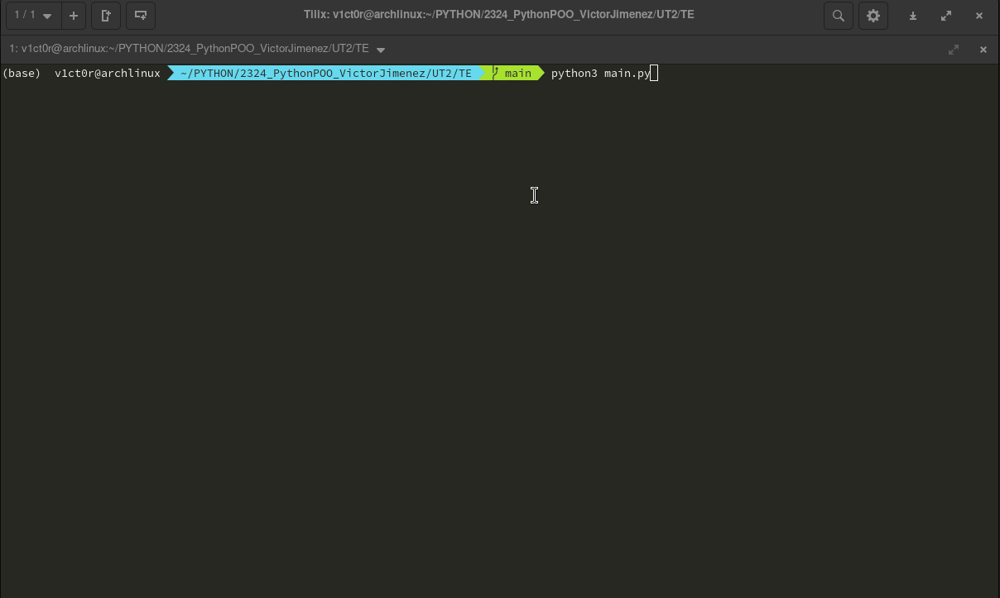
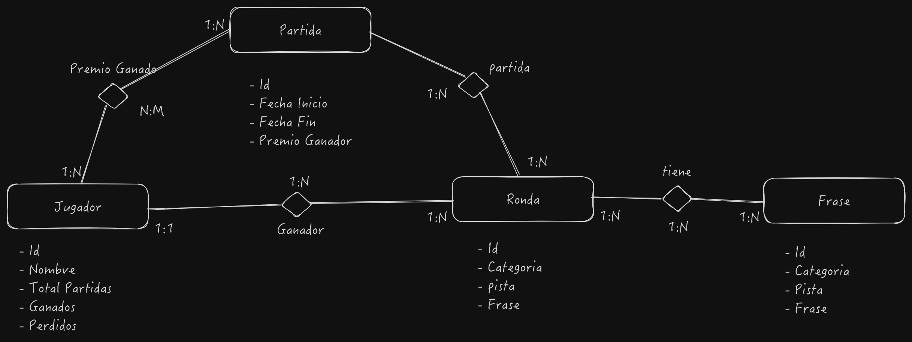

# Ruleta-de-la-fortuna
Fortune roulette game



# Ruleta de la fortuna savegame

## Introducción

El juego almacena los datos dentro de una carpeta llamada ".ruleta_fortuna" en el home del usuario. Dentro de esta carpeta se almacena un fichero con la información de la partida guardada.
El nombre del fichero de la partida guardada es savegame, existe una constante en el programa en el fichero constantes.py 
donde se define que tipo de archivo (csv y json) 


## Formato CSV

En el formato CSV, cada fila representa un registro y cada columna representa un campo del registro. La primera fila contiene los nombres de las columnas y el resto de las filas contienen el contenido de las columnas.

Los datos para guardar en formato CSV son:

- Nombre del jugador
- Dinero acumulado del jugador, tanto a nivel de ronda como total
- Tipo de jugador
- Número de rondas

Aquí hay un ejemplo de un savegame CSV:

```
nombre,prizeMoney,priceMoneyRound,tipo
John,1000,500,1     // nombre,dineroPremio,dineroPremioRonda,tipo
Carlos,230,600,1    // Puede haber más jugadores en la partida se creará una linea por cada jugador
2                   // Número de ronda actual
```

## Formato JSON

El formato JSON es un formato estructurado, donde la información no se almacena en forma tabular, sino en forma jerárquica.

Los datos para guardar en formato JSON son:

- Nombre del jugador
- Dinero acumulado del jugador, tanto a nivel de ronda como total
- Número de ronda actual
- Tipo de jugador

Un ejemplo de un savegame JSON:

```json
{
    "rondas": 2,
    "players": [
        {
            "name": "John",
            "prizeMoney": 1000,
            "priceMoneyRound": 500,
            "tipo": 1
        }
    ]
}
```


# Actualizaciones del Programa Ruleta de la Fortuna

## Cambios Realizados

Se han relaizado e implantado que la indormación que se desea guardar como la información de las partidas, jugadores y premios en una base de datos, para así poder obtener estadísticas y conocer por ejemplo, el jugador que más partidas ha ganado, el premio más alto entregado, las partidas más largas, etc.

Para ello he implantado la utilización de una BD SQLite, y se utiliza el ORM Peewee para gestionar la base de datos.

La base de datos se alamncena en un archivo llamado `metrica.db` dentro de la carpeta que crea el juego en el directorio 'home' del usuario '~/.ruleta_fortuna' junto al archivo de configuracioón del juego y los savegames.

## Diagrama de la Base de Datos

Diagrama de la base de datos del programa:



## Modelos de la Base de Datos

### PlayerModel

Este modelo representa a un jugador en la base de datos. Almacena el nombre del jugador y las estadísticas del juego, como el número de juegos jugados, ganados y perdidos.

### GameModel

Este modelo representa una partida de juego. Almacena la fecha de inicio y fin de la partida, así como el premio total ganado en la partida.

### GamePlayerModel

Este modelo representa la relación entre un jugador y una partida. Almacena el premio que un jugador ha ganado en una partida específica.

### RoundModel y PhraseModel

Estos modelos representan una ronda de juego y una frase utilizada en el juego, respectivamente.

## Recopilación de Métricas

La recopilación de métricas se realiza a través de los métodos en los modelos. Por ejemplo, cuando se inicia una nueva partida, se crea una nueva instancia de `GameModel` y se guarda en la base de datos. De manera similar, cuando un jugador gana una partida, se actualiza el campo `gamesWon` del `PlayerModel` correspondiente.

## Demostración del Programa

Aquí está un GIF que muestra cómo funciona el programa:

